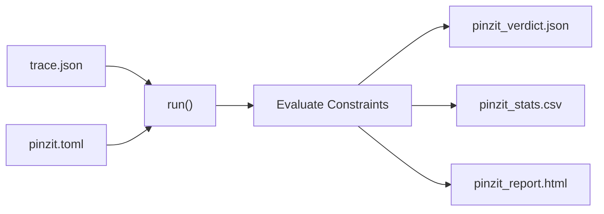

# Pinzit — Agent Development Guide

> This document is intended for AI coding agents. It describes everything needed
> to navigate, build, test, and extend the Pinzit project. Assume zero prior
> knowledge.

---

## 0. Quick Orientation (Start Here)

If you are an AI agent dropped into this project for the first time, read this
section before anything else.

**What Pinzit does**: Reads an OpenTelemetry JSON trace file and a TOML
configuration file, evaluates the trace against three reliability constraints,
and writes structured reports (HTML, JSON, CSV) to an output directory. It then
exits with a code indicating pass, fail, or error.

**Current state of the codebase**:

> **Functional evaluation phase.** The CLI, config parser, output writers, and
> std-only trace parsing are functional. All three built-in constraints now
> compute verdicts from trace content and config thresholds. See Section 14 for
> current limitations.

**Single file**: All logic — argument parsing, config loading, trace parsing,
constraint evaluation, and output rendering — lives in `src/main.rs`. There are
no modules, no workspace members, and no external crates.

**Where to start for common tasks**:

| Task                           | Where to look                           |
|--------------------------------|-----------------------------------------|
| Add / change a CLI flag        | `parse_args()`                           |
| Add / change a config key      | `Config` struct, `parse_config()`        |
| Change constraint logic        | `evaluate_slfs()`, `evaluate_rtcb()`, `evaluate_brc()` |
| Add a new constraint           | Section 12 of this file                  |
| Add a test                     | `mod tests` block at bottom of `main.rs` |
| Understand output format       | Section 8 of this file                  |

---

## 1. Project Overview

Pinzit is a **Trace-Native Reliability Intelligence CLI** written in Rust. It
ingests [OpenTelemetry](https://opentelemetry.io/) JSON traces and evaluates
them against configurable safety constraints, producing **CI-ready verdicts and
auditor-grade reports** in HTML, JSON, and CSV formats.

**Core Philosophy**: Read-only analysis. **No side effects.** Pinzit evaluates
systems but never acts on them — it has no network access, no LLM integration,
and never mutates runtime systems or input files.

**Target audience for reports**: SRE, Platform Engineering, Observability,
Security Engineering, and Reliability/Systems Architecture teams.

**Design rationale for zero dependencies**: The `[dependencies]` section in
`Cargo.toml` is intentionally empty. All parsers (CLI args, TOML config, JSON
output rendering) are hand-rolled using only `std`. This eliminates supply-chain
risk, keeps the binary fully self-contained, and ensures the tool works in
air-gapped CI environments. Before adding any external crate, get explicit
approval — this is a core constraint of the project.

---

## 2. Technology Stack

| Component             | Technology                              | Notes                          |
|-----------------------|-----------------------------------------|--------------------------------|
| Language              | Rust (Edition 2021)                     | Minimum version: 1.65+         |
| Build Tool            | Cargo                                   | Tested with Cargo 1.93.0       |
| Rust Compiler         | rustc                                   | Tested with rustc 1.93.0       |
| External Dependencies | **None** — `std` library only           | Intentional; see Section 1     |
| Input Format          | OpenTelemetry JSON traces               | Shape-validated, not full-parsed |
| Config Format         | Custom TOML subset (hand-rolled parser) | 14 required keys               |
| Output Formats        | HTML, JSON, CSV                         | Manually rendered via `format!()` |
| `std` modules used    | `collections`, `env`, `fs`, `path`      | No other `std` modules needed  |

---

## 3. Project Structure

```text
.
├── Cargo.toml              # Package manifest (name: pinzit, v0.1.0)
├── Cargo.lock              # Dependency lockfile (no external crates)
├── src/
│   └── main.rs             # Entire application — 413 lines, single file
├── examples/
│   ├── trace.json          # Minimal OpenTelemetry trace (1 resourceSpan)
│   └── pinzit.toml         # Complete config with all constraint sections
├── .gitignore              # Ignores /target and /pinzit_out
├── README.md               # User-facing documentation and positioning
└── AGENTS.md               # This file
```

### Architecture Notes

- **Single-file design** — All logic lives in `src/main.rs`. This is
  intentional; the project is designed to be minimal and focused.
- **Zero external dependencies** — Only `std` is used (`std::collections`,
  `std::env`, `std::fs`, `std::path`).
- **Hand-rolled parsers** — CLI args (lines 52–115), TOML config (lines
  236–306), and JSON output rendering (lines 308–344, 347–391) are all
  manually implemented without crates.
- **Two data structs** — `Cli` (lines 6–14) holds parsed CLI arguments;
  `Config` (lines 16–32) holds all config values.

### Data Flow



### Key Functions (by line range in `main.rs`)

| Function                          | Lines     | Purpose                                                           |
|-----------------------------------|-----------|-------------------------------------------------------------------|
| `main()`                          | 34–50     | Entry point, delegates to `parse_args` and `run`                  |
| `parse_args()`                    | 52–115    | Manual CLI argument parsing                                       |
| `run()`                           | 117–226   | Core logic: load config, validate trace, evaluate constraints, write outputs |
| `validate_json_shape()`           | 228–234   | Checks trace starts/ends with `{` / `}`                           |
| `parse_config()`                  | 236–264   | Hand-rolled TOML key-value parser                                 |
| `get_raw/string/u64/bool/array()` | 266–306   | Config value accessor helpers                                     |
| `quote_json()`                    | 308–310   | JSON string escaping utility                                      |
| `render_constraint_json()`        | 312–345   | Builds per-constraint JSON fragment                               |
| `write_json()`                    | 347–364   | Writes `pinzit_verdict.json`                                      |
| `write_csv()`                     | 366–370   | Writes `pinzit_stats.csv`                                         |
| `write_html()`                    | 372–391   | Writes `pinzit_report.html`                                       |
| `tests` module                    | bottom of file | Unit tests (currently 4 tests)                                |

> **Line numbers are approximate.** They are accurate for the commit described
> in this document but may shift as the file grows. Use `grep` or your editor's
> search to locate functions by name.

---

## 4. Build and Test Commands

```bash
# Build (debug)
cargo build

# Build (release, optimized)
cargo build --release

# Run all tests
cargo test

# Run tests with stdout output
cargo test -- --nocapture

# Run a specific test by name
cargo test parses_arrays

# Check formatting (does not modify files)
cargo fmt --check

# Apply formatting
cargo fmt

# Run linter
cargo clippy

# Run with example data
cargo run -- \
  --trace ./examples/trace.json \
  --config ./examples/pinzit.toml \
  --outdir ./pinzit_out \
  --format html,json,csv

# Install the binary locally
cargo install --path .
```

> **Expected test output**: 4+ passed, 0 failed, 0 ignored.
>
> `cargo clippy` should report no warnings. `cargo fmt --check` should exit
> cleanly. If either fails, fix the issue before submitting changes.

---

## 5. CLI Interface

### Usage

```bash
pinzit --trace <path> [--config pinzit.toml] [--outdir ./pinzit_out] [--format html,json,csv] [--fail-fast] [--no-recommend]
```

### Flags

| Flag             | Required | Default          | Description                                              |
|------------------|----------|------------------|----------------------------------------------------------|
| `--trace`        | **Yes**  | —                | Path to OpenTelemetry JSON trace                         |
| `--config`       | No       | `pinzit.toml`    | Path to configuration file                               |
| `--outdir`       | No       | `./pinzit_out`   | Output directory for reports                             |
| `--format`       | No       | `html,json,csv`  | Comma-separated output formats                           |
| `--fail-fast`    | No       | `false`          | Stop evaluating additional constraints after first FAIL   |
| `--no-recommend` | No       | `false`          | Suppress recommendations in output                       |
| `--help`, `-h`   | No       | —                | Show one-line usage and exit                             |

### Exit Codes

| Code | Meaning                                      |
|------|----------------------------------------------|
| `0`  | PASS — All constraints satisfied             |
| `1`  | FAIL — One or more constraints violated      |
| `2`  | Config/parse error — Invalid input or config |

> **Note**: `--fail-fast` short-circuits later constraint evaluation after the
> first failing constraint. In JSON output, skipped constraints are marked as
> `SKIPPED`.

---

## 6. Configuration Format (`pinzit.toml`)

### Full Example (from `examples/pinzit.toml`)

```toml
[meta]
audit_name = "Production Trace"
auditor = "Pinzit v0.1.0"
standard = "IEC-61508"

[constraints.slfs_001]
signal_loss_timeout_ms = 500
safe_state_deadline_ms = 250
unsafe_action_patterns = ["motion", "punch", "actuate", "write", "commit"]
safe_state_patterns = ["halt", "brake", "safe", "readonly", "degraded"]

[constraints.rtcb_002]
max_recovery_ms = 30000
recovery_span_name = "system.recovery"
recovery_attribute = "recovery.complete"
stability_check = true

[constraints.brc_003]
max_propagation_hops = 2
containment_timeout_ms = 2000
isolation_boundary_attribute = "fault.isolation"
```

### Parser Behavior

The parser (`parse_config`, line 236) is a simplified TOML reader:

- **Ignores**: blank lines, lines starting with `#` (comments), lines starting
  with `[` (section headers).
- **Reads**: `key = value` pairs. Section headers are ignored — all keys must
  be globally unique.
- **Supported types**: quoted strings, integers, booleans (`true`/`false`),
  arrays (`["item1", "item2"]`).
- **All 14 config keys are required** — a missing key produces an error
  (`missing config key: {key}`).

### Required Config Keys (mapped to `Config` struct fields)

| TOML Key                        | Rust Field                           | Type          |
|---------------------------------|--------------------------------------|---------------|
| `audit_name`                    | `audit_name`                         | `String`      |
| `auditor`                       | `auditor`                            | `String`      |
| `standard`                      | `standard`                           | `String`      |
| `signal_loss_timeout_ms`        | `slfs_signal_loss_timeout_ms`        | `u64`         |
| `safe_state_deadline_ms`        | `slfs_safe_state_deadline_ms`        | `u64`         |
| `unsafe_action_patterns`        | `slfs_unsafe_action_patterns`        | `Vec<String>` |
| `safe_state_patterns`           | `slfs_safe_state_patterns`           | `Vec<String>` |
| `max_recovery_ms`               | `rtcb_max_recovery_ms`               | `u64`         |
| `recovery_span_name`            | `rtcb_recovery_span_name`            | `String`      |
| `recovery_attribute`            | `rtcb_recovery_attribute`            | `String`      |
| `stability_check`               | `rtcb_stability_check`               | `bool`        |
| `max_propagation_hops`          | `brc_max_propagation_hops`           | `u64`         |
| `containment_timeout_ms`        | `brc_containment_timeout_ms`         | `u64`         |
| `isolation_boundary_attribute`  | `brc_isolation_boundary_attribute`   | `String`      |

---

## 7. Built-in Constraints

Three constraint categories are implemented. Each produces a JSON object with
`verdict`, `metrics`, `evidence_spans`, and `recommendations`.

### SLFS-001 — Fail-Safe Fallback

Ensures unsafe operations do not occur after telemetry loss unless a safe state
is confirmed within the allowed window.

- **Config keys**: `signal_loss_timeout_ms`, `safe_state_deadline_ms`,
  `unsafe_action_patterns`, `safe_state_patterns`
- **Evidence span**: `trace.span.signal_loss`
- **Recommendation**: "Block unsafe operations when telemetry age exceeds
  threshold."

### RTCB-002 — Recovery Time Bound

Verifies the system reaches a stable state within a declared recovery ceiling.

- **Config keys**: `max_recovery_ms`, `recovery_span_name`,
  `recovery_attribute`, `stability_check`
- **Evidence span**: `trace.span.system.recovery`
- **Recommendation**: "Cap retry backoff and bound readiness checks."

### BRC-003 — Blast Radius Containment

Detects failures propagating beyond isolation boundaries or hop limits.

- **Config keys**: `max_propagation_hops`, `containment_timeout_ms`,
  `isolation_boundary_attribute`
- **Evidence span**: `trace.span.fault.isolation`
- **Recommendation**: "Introduce bulkheads and fan-out limits."

Constraint verdicts are evaluated from parsed span data and config thresholds.

---

## 8. Output Files

| File                   | Format | Description                                          |
|------------------------|--------|------------------------------------------------------|
| `pinzit_verdict.json`  | JSON   | Machine-readable verdict for CI/automation           |
| `pinzit_stats.csv`     | CSV    | Flat metrics (`resource_span_markers`, `parsed_span_count`, `overall_verdict`) |
| `pinzit_report.html`   | HTML   | Self-contained audit report with per-constraint summary table |

### JSON Verdict Structure

```json
{
  "overall_verdict": "PASS",
  "constraints": {
    "brc_003": { "verdict": "PASS", "metrics": {...}, "evidence_spans": [...], "recommendations": [...] },
    "rtcb_002": { "verdict": "PASS", "metrics": {...}, "evidence_spans": [...], "recommendations": [...] },
    "slfs_001": { "verdict": "PASS", "metrics": {...}, "evidence_spans": [...], "recommendations": [...] }
  }
}
```

> Constraint keys in the JSON output are sorted alphabetically because
> `BTreeMap` is used internally. This ordering is deterministic and
> intentional.

### CSV Format

The current CSV output (`pinzit_stats.csv`) writes metric/value rows:

```csv
metric,value
resource_span_markers,<count>
parsed_span_count,<count>
overall_verdict,<PASS|FAIL>
```

`resource_span_markers` is the number of times the string `"resourceSpans"`
appears in the raw trace file (string matching, not parsed JSON).

### HTML Format

The HTML report is self-contained — no external CSS or JavaScript dependencies.
It lists audit metadata, overall verdict, parsed span metrics, and a
per-constraint summary table.

---

## 9. Testing Strategy

### Existing Tests

Tests are in the `#[cfg(test)] mod tests` block at the bottom of `main.rs`.
Current tests:

| Test Name               | What It Validates                                           |
|-------------------------|-------------------------------------------------------------|
| `parses_arrays`         | `get_array()` correctly parses `["a", "b"]`                 |
| `validates_json_shape`  | `validate_json_shape()` accepts `{...}`, rejects non-object |
| `parses_full_config`    | `parse_config()` loads all required keys                    |
| `run_returns_fail_exit_code_on_constraint_failure` | `run()` returns `1` on a violating trace |

### Running Tests

```bash
cargo test                   # All tests
cargo test -- --nocapture    # With stdout
cargo test parses_arrays     # Specific test
```

### Adding New Tests

Append to the `mod tests` block at the bottom of `main.rs`:

```rust
#[test]
fn my_new_test() {
    // ...
}
```

### Areas Without Tests (Priority Order)

The following areas have no test coverage. Work on them in priority order:

| Priority | Area                            | Why it matters                                    |
|----------|---------------------------------|---------------------------------------------------|
| P0       | Error paths                     | Missing config keys, invalid integers, bad JSON   |
| P1       | `parse_args()`                  | CLI parsing correctness                           |
| P1       | Constraint edge cases           | Boundary timestamps, missing attributes, hop logic |
| P2       | Output writers                  | `write_json`, `write_csv`, `write_html`           |
| P2       | End-to-end pipeline             | Trace in → output files out                       |

---

## 10. Code Style Guidelines

### Diagrams in Markdown

- **Use Mermaid.js** for all diagrams in `.md` files. Do not use ASCII art.
- Mermaid renders natively on GitHub and most modern Markdown viewers.
- Wrap diagrams in ` ```mermaid ` fenced code blocks.

### General Principles

- **Single file**: All logic stays in `src/main.rs`. Do not split without good reason.
- **No external crates**: Implement it yourself or use `std`. The `[dependencies]`
  section in `Cargo.toml` is intentionally empty.
- **Explicit over clever**: The custom parsers are verbose but readable.
- **No `unsafe` code**: All code must compile with safe Rust only.

### Naming Conventions

| Item                  | Convention                   | Example                        |
|-----------------------|------------------------------|--------------------------------|
| Functions             | `snake_case`                 | `parse_config`, `get_array`    |
| Variables             | `snake_case`                 | `span_count`                   |
| Structs               | `PascalCase`                 | `Cli`, `Config`                |
| Constants             | `SCREAMING_SNAKE_CASE`       | (none currently)               |
| Constraint IDs        | `{category}_{number}`        | `slfs_001`, `rtcb_002`         |
| Config struct fields  | Prefixed by constraint ID    | `slfs_signal_loss_timeout_ms`  |

### Error Handling

- Use `Result<T, String>` for fallible functions.
- Error messages should be actionable: `"failed to read {path}: {error}"`.
- Fatal errors call `std::process::exit(2)` from `main()`.
- Helper `get_*` functions return descriptive errors:
  `"missing config key: {key}"`, `"invalid integer for {key}: {raw}"`.

### String / JSON Handling

- The codebase uses owned `String` types extensively (not `&str`).
- JSON output is built via manual `format!()` string concatenation — no
  serialization crate.
- JSON strings are escaped via `quote_json()` (line 308).
- Constraint ordering in JSON output uses `BTreeMap` for deterministic key order.

### Formatting and Lint

- Run `cargo fmt` before committing. The project follows default `rustfmt`
  settings with no custom `rustfmt.toml`.
- Run `cargo clippy` and resolve all warnings before submitting. The project
  targets zero clippy warnings.

---

## 11. Security Considerations

- **Read-only by design**: Pinzit never writes to the trace file or mutates
  runtime systems.
- **No network access**: The binary makes zero network requests.
- **No LLM integration**: Recommendations are deterministic, rule-based, and
  statically defined in source code. Output is fully reproducible given the
  same inputs.
- **Minimal input validation**: JSON is validated only for outer `{` / `}`
  shape — there is no full JSON parser. Malformed trace content beyond that
  boundary will not cause a panic but will produce inaccurate metrics.
- **No `unsafe` code**: The entire codebase uses safe Rust.
- **Path handling**: Uses `std::path::PathBuf` for cross-platform path safety.
- **No environment variable secrets**: The application reads no environment
  variables beyond CLI args.
- **Supply-chain security**: Zero external dependencies is a deliberate
  security posture. Adding a dependency opens the supply chain to that
  crate's transitive dependency graph. This risk is unacceptable for a tool
  intended to run in CI pipelines auditing safety-critical systems.
- **Output directory**: The tool creates the output directory if it does not
  exist (`std::fs::create_dir_all`). Verify the `--outdir` path before running
  in production environments.

---

## 12. Adding New Constraints

To add a new constraint (e.g., `xyz_004`):

1. **Add config fields** to the `Config` struct (line 16):

   ```rust
   // XYZ-004 fields
   xyz_some_threshold_ms: u64,
   xyz_some_pattern: String,
   ```

2. **Parse the new fields** in `parse_config()` using the `get_*` helpers
   (line 236):

   ```rust
   xyz_some_threshold_ms: get_u64(&raw, "some_threshold_ms")?,
   xyz_some_pattern: get_string(&raw, "some_pattern")?,
   ```

3. **Add the constraint evaluation function** (e.g., `evaluate_xyz`) and call
   it from `run()` with `constraints.insert(...)`:

   ```rust
   let xyz = evaluate_xyz(&config, &spans, recommendations_enabled);
   constraints.insert(
       "xyz_004".to_string(),
       xyz,
   );
   ```

4. **Add the new TOML keys** to `examples/pinzit.toml` under a new constraint
   section.

5. **Add tests** in the `mod tests` block at the bottom of `main.rs`.

6. **Document** the new constraint in `AGENTS.md` Section 7 and `README.md`.

---

## 13. CI Integration

Pinzit is designed for CI/CD pipelines. Example GitHub Actions workflow:

```yaml
name: Pinzit Verdict
on: [pull_request]

jobs:
  pinzit:
    runs-on: ubuntu-latest
    steps:
      - uses: actions/checkout@v4
      - name: Install Rust
        uses: dtolnay/rust-toolchain@stable
      - name: Build
        run: cargo build --release
      - name: Run analysis
        run: |
          cargo run --release -- \
            --trace ./trace.json \
            --config ./pinzit.toml \
            --outdir ./pinzit_out
      - name: Upload report
        uses: actions/upload-artifact@v4
        with:
          name: pinzit-report
          path: ./pinzit_out/
```

The process exits with code `0` (PASS) or `1` (FAIL), making it suitable as a
CI gate. Exit code `2` indicates a configuration or parsing error.

> **Note for CI integrations**: Verdicts now reflect evaluated constraints.
> Keep in mind parsing remains heuristic (see Section 14), so malformed or
> highly non-standard trace JSON may produce inaccurate analysis.

---

## 14. Known Limitations and TODOs

These are factual observations from the current source code, in priority order:

| Priority | Limitation                         | Detail                                                                                                   |
|----------|------------------------------------|----------------------------------------------------------------------------------------------------------|
| P0       | **Heuristic JSON parsing**         | Trace is not fully schema-validated; parser uses targeted key/array/object extraction from raw JSON.    |
| P1       | **Constraint heuristics**          | SLFS/RTCB/BRC rely on naming/attribute conventions and may need tightening for varied trace producers.  |
| P2       | **HTML detail depth**              | Report includes summary table, but no causal timeline or per-span evidence detail pages yet.            |
| P2       | **CSV breadth**                    | CSV contains global metrics but not per-constraint threshold/observed rows yet.                         |
| P2       | **Test coverage still limited**    | Key paths are covered, but parse-args/output-writer/end-to-end matrix remains incomplete.               |

---

## 15. Development Checklist

Before submitting changes:

- [ ] `cargo test` passes (all 2+ tests)
- [ ] `cargo build` succeeds with **no warnings**
- [ ] `cargo clippy` reports no warnings
- [ ] `cargo fmt --check` exits cleanly (no formatting diffs)
- [ ] `cargo run -- --help` displays usage correctly
- [ ] Example command runs without errors:

  ```bash
  cargo run -- --trace ./examples/trace.json --config ./examples/pinzit.toml --outdir ./test_out
  ```

- [ ] Expected output files are generated in `./test_out/`
- [ ] Exit codes behave correctly (`0` = PASS, `1` = FAIL, `2` = error)
- [ ] No external crates added to `Cargo.toml` without explicit approval
- [ ] New constraints are documented in Section 7 of this file and in `README.md`

---

## 16. Glossary

| Term                  | Definition                                                                         |
|-----------------------|------------------------------------------------------------------------------------|
| **OTel / OpenTelemetry** | Open-source observability framework; defines trace, metric, and log formats.    |
| **Trace**             | A JSON document representing a distributed request journey as a tree of spans.     |
| **Span**              | A single timed operation within a trace, with a name, duration, and attributes.    |
| **resourceSpans**     | The top-level key in an OTel JSON trace grouping spans by resource.                |
| **SLFS-001**          | Fail-Safe Fallback: checks that unsafe actions are blocked after signal loss.      |
| **RTCB-002**          | Recovery Time Bound: checks that system recovery completes within a time ceiling.  |
| **BRC-003**           | Blast Radius Containment: checks that fault propagation stays within boundaries.   |
| **Verdict**           | Binary outcome of a constraint evaluation: `PASS` or `FAIL`.                      |
| **Evidence span**     | A named span in the trace used as proof for a constraint decision.                 |
| **Scaffolded**        | Code that compiles and runs but contains placeholder logic (hardcoded results).    |
| **IEC-61508**         | International safety standard for electrical/electronic/programmable systems.     |

---

## 17. License

MIT
