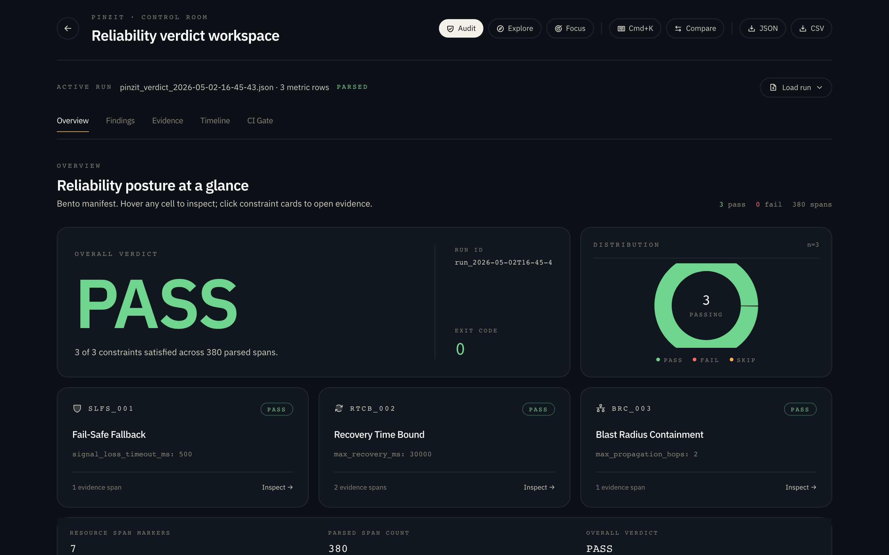
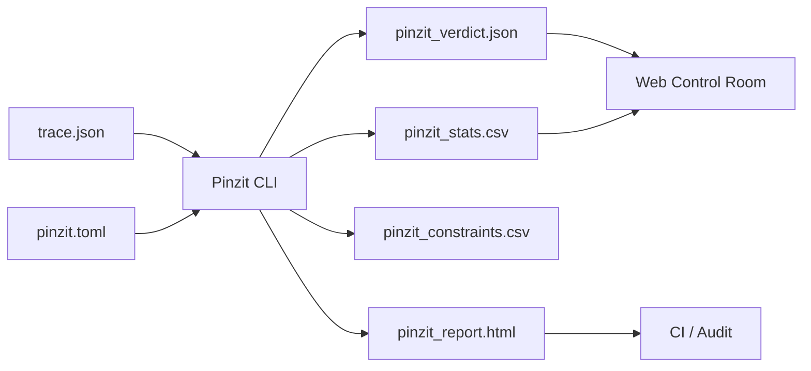

# Pinzit

> Read-only reliability analysis for OpenTelemetry traces.
> Zero dependencies. Deterministic verdicts. No side effects.

Pinzit reads an OpenTelemetry JSON trace, evaluates it against three safety constraints, and writes CI-ready reports (HTML, JSON, CSV). It never calls a network, never mutates a runtime, and never hallucinates. Same inputs, same verdict, every time.


## Quick Start

```bash
git clone https://github.com/AngelP17/Pinzit.git && cd Pinzit
cargo build --release
cargo run -- --trace ./examples/trace.json --config ./examples/pinzit.toml --outdir ./pinzit_out
```

### Web UI

```bash
cd web && npm install && npm run dev
```

Client-only control room. No backend. Drop `pinzit_verdict.json` + `pinzit_stats.csv` to inspect verdicts, evidence spans, incident timeline, and CI gate.



## How It Works



### Built-In Constraints

| ID | Name | Checks |
|----|------|--------|
| SLFS-001 | Fail-Safe Fallback | No unsafe operation after telemetry loss before safe state |
| RTCB-002 | Recovery Time Bound | System recovers within declared ceiling |
| BRC-003 | Blast Radius Containment | Failure stays inside isolation boundary |

Each constraint produces a binary verdict, quantitative metrics, evidence spans, and a deterministic recommendation.

### Exit Codes

| Code | Meaning |
|------|---------|
| `0` | PASS |
| `1` | FAIL |
| `2` | Config or parse error |

## CLI

```bash
pinzit --trace <path> [--config pinzit.toml] [--outdir ./pinzit_out] [--format html,json,csv] [--fail-fast] [--no-recommend]
```

| Flag | Default | Description |
|------|---------|-------------|
| `--trace` | required | Path to OpenTelemetry JSON trace |
| `--config` | `pinzit.toml` | Path to configuration file |
| `--outdir` | `./pinzit_out` | Output directory for reports |
| `--format` | `html,json,csv` | Comma-separated output formats |
| `--fail-fast` | `false` | Stop after first FAIL |
| `--no-recommend` | `false` | Suppress recommendations |

## Configuration

See [`examples/pinzit.toml`](examples/pinzit.toml) for a complete file.

```toml
[meta]
audit_name = "Production Trace"
auditor = "Pinzit v0.1.0"
standard = "IEC-61508"

[constraints.slfs_001]
signal_loss_timeout_ms = 500
safe_state_deadline_ms = 250
unsafe_action_patterns = ["motion", "punch", "actuate", "write", "commit"]
safe_state_patterns = ["halt", "brake", "safe", "readonly", "degraded"]

[constraints.rtcb_002]
max_recovery_ms = 30000
recovery_span_name = "system.recovery"
recovery_attribute = "recovery.complete"
stability_check = true

[constraints.brc_003]
max_propagation_hops = 2
containment_timeout_ms = 2000
isolation_boundary_attribute = "fault.isolation"
```

## CI Integration

```yaml
name: Pinzit Verdict
on: [pull_request]

jobs:
  pinzit:
    runs-on: ubuntu-latest
    steps:
      - uses: actions/checkout@v4
      - uses: dtolnay/rust-toolchain@stable
      - run: cargo build --release
      - run: |
          cargo run --release -- \
            --trace ./trace.json \
            --outdir ./pinzit_out
      - uses: actions/upload-artifact@v4
        with:
          name: pinzit-report
          path: ./pinzit_out/
```

## Project Structure

```text
.
├── src/main.rs             # Single-file Rust application (zero dependencies)
├── web/                    # Vite + React + TypeScript control room
├── examples/
│   ├── trace.json          # Minimal OpenTelemetry trace
│   └── pinzit.toml         # Full constraint configuration
├── AGENTS.md               # AI agent development guide
└── README.md
```

## Development

```bash
cargo build --release       # Build
cargo test                  # Test (14 tests)
cargo fmt --check           # Format check
cargo clippy                # Lint
cd web && npm run typecheck # Frontend types
cd web && npm run build:guard # Frontend build (main chunk <= 220KB)
```

See [`AGENTS.md`](AGENTS.md) for full development guidelines.

## Status

Alpha. CLI, config parsing, trace evaluation, and output writers are functional. All three constraints compute verdicts from trace content. Web UI includes Timeline and CI Gate tabs. See [Roadmap in AGENTS.md](AGENTS.md#14-known-limitations-and-todos) for remaining work.

## License

MIT
