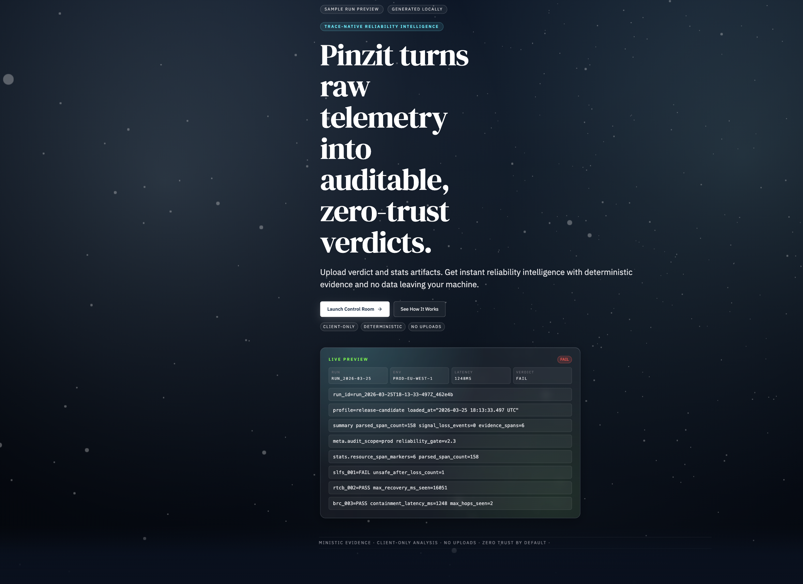
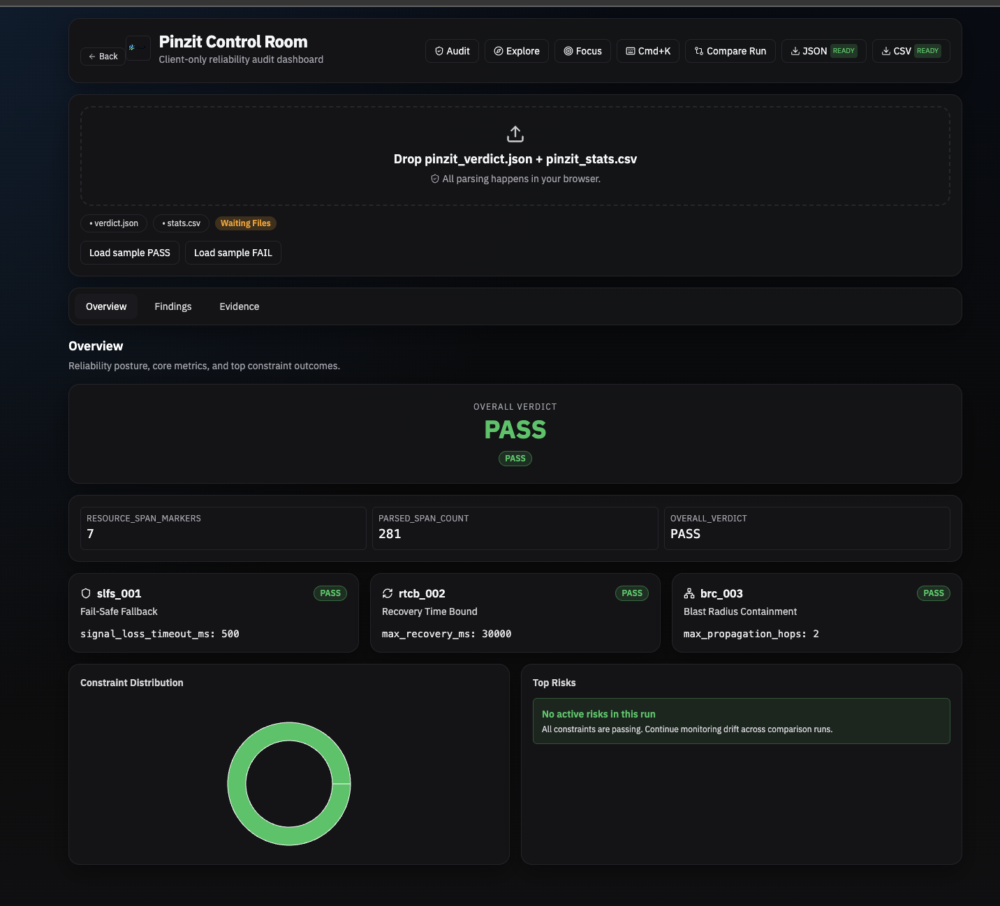
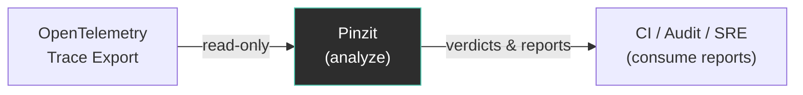

# Pinzit — Trace-Native Reliability Intelligence

> **SRE · Platform · Observability · Security**
>
> Pinzit converts OpenTelemetry traces into **incident timelines, compliance
> verdicts, and deterministic recommended actions** — producing CI-ready
> artifacts and auditor-grade reports **without executing, orchestrating, or
> mutating runtime systems**.

---

## Project Status

> **Alpha / Functional Evaluation Phase.**
> The CLI, config system, std-only trace parsing, and output writers are
> implemented. Built-in constraints now evaluate parsed spans and can return
> `PASS` or `FAIL` based on trace content. See [Roadmap](#roadmap) for
> remaining quality and coverage improvements.
>
> **Web UI included:** A client-only React control room now lives in
> [`web/`](web), with a landing-first experience and interactive dashboard.

---

## Why Pinzit Exists

Modern systems already emit massive amounts of telemetry (OpenTelemetry,
Datadog, Grafana). Incident-management platforms coordinate humans
(PagerDuty, Rootly).

**What's missing is judgment.**

Pinzit lives in the gap between **telemetry** and **truth**.

It answers questions that dashboards and runbooks don't:

1. What actually failed first?
2. How did the failure propagate?
3. Did the system recover *within required bounds*?
4. Which invariants were violated?
5. What concrete changes would have prevented or mitigated the outcome?

> **Pinzit does not act on systems. It evaluates them.**

---

## What Pinzit Is

| ✓ | Capability |
|---|------------|
| ✓ | **Read-only analysis engine** for distributed-systems telemetry |
| ✓ | **Causal graph reconstruction** from OpenTelemetry traces |
| ✓ | **Constraint-based verdicts** (`PASS` / `FAIL`) |
| ✓ | **Incident timeline reconstruction** |
| ✓ | **Static, deterministic recommendations** (auditor-safe) |
| ✓ | **Multi-format reporting**: HTML · JSON · CSV |
| ✓ | **CI-ready** (exit codes + machine-readable output) |

## What Pinzit Is Not

- Not an incident commander or on-call paging system
- Not a runbook executor or auto-healer
- Not a control plane or monitoring dashboard

Pinzit has **no side effects**. It reads telemetry, produces evidence, and exits.

---

## 30-Second Positioning

> Telemetry tells you *what happened*.
> Runbooks tell you *what to do*.
> **Pinzit tells you whether the system behaved correctly — and why it didn't.**

---

## Project Definition

| Field       | Value                                    |
|-------------|------------------------------------------|
| **Name**    | `pinzit`                                 |
| **Binary**  | `pinzit`                                 |
| **Tagline** | Trace-Native Reliability Intelligence    |
| **Type**    | Rust CLI (zero dependencies)             |
| **Inputs**  | OpenTelemetry JSON trace + `pinzit.toml` |
| **Outputs** | HTML · JSON · CSV                        |
| **Exit**    | `0` = PASS · `1` = FAIL · `2` = error   |
| **License** | MIT                                      |

---

## Quick Start

### Prerequisites

- [Rust toolchain](https://rustup.rs/) (1.65+)

### Install & Run

```bash
# Clone and build
git clone https://github.com/AngelP17/Pinzit.git
cd Pinzit
cargo build --release

# Run with the included example
cargo run -- \
  --trace ./examples/trace.json \
  --config ./examples/pinzit.toml \
  --outdir ./pinzit_out \
  --format html,json,csv
```

### Install Globally

```bash
cargo install --path .
pinzit --trace ./examples/trace.json
```

### Launch Web UI

```bash
cd web
npm install
npm run dev
```

Then open the local URL printed by Vite (usually
`http://127.0.0.1:5173/` or next available port).

### Web Control Room + Landing v2

The `web/` app is fully client-side (no backend) and now ships with:

- Cinematic landing hero with layered atmosphere, floating nav, and motion choreography
- Interactive control room dashboard (Overview, Findings, Evidence)
- Compare-run modal for baseline vs current analysis
- Strict file validation for `pinzit_verdict.json` + `pinzit_stats.csv`
- Shared realistic mock-run generator powering landing live preview and sample loads
- Local persistence (`pinzit-ui-v1`) for active run, tab, filters, and view state
- Build guard that fails if the main bundle exceeds `220KB`





Build verification:

```bash
cd web
npm run typecheck
npm run build:guard
```

---

## CLI Usage

```bash
pinzit \
  --trace ./trace.json \
  [--config ./pinzit.toml] \
  [--outdir ./pinzit_out] \
  [--format html,json,csv] \
  [--fail-fast] \
  [--no-recommend]
```

| Flag             | Required | Default          | Description                        |
|------------------|----------|------------------|------------------------------------|
| `--trace`        | **Yes**  | —                | Path to OpenTelemetry JSON trace   |
| `--config`       | No       | `pinzit.toml`    | Path to configuration file         |
| `--outdir`       | No       | `./pinzit_out`   | Output directory for reports       |
| `--format`       | No       | `html,json,csv`  | Comma-separated output formats     |
| `--fail-fast`    | No       | `false`          | Exit on first violation            |
| `--no-recommend` | No       | `false`          | Suppress recommendations in output |
| `--help`, `-h`   | No       | —                | Show usage and exit                |

> Exit codes are active: `0` = PASS, `1` = FAIL, `2` = config/parse error.

---

## Configuration (`pinzit.toml`)

```toml
[meta]
audit_name = "Production Trace"
auditor = "Pinzit v0.1.0"
standard = "IEC-61508"

[constraints.slfs_001]
signal_loss_timeout_ms = 500
safe_state_deadline_ms = 250
unsafe_action_patterns = ["motion", "punch", "actuate", "write", "commit"]
safe_state_patterns = ["halt", "brake", "safe", "readonly", "degraded"]

[constraints.rtcb_002]
max_recovery_ms = 30000
recovery_span_name = "system.recovery"
recovery_attribute = "recovery.complete"
stability_check = true

[constraints.brc_003]
max_propagation_hops = 2
containment_timeout_ms = 2000
isolation_boundary_attribute = "fault.isolation"
```

See the full example at [`examples/pinzit.toml`](examples/pinzit.toml).

---

## Built-In Constraints

### SLFS-001 — Fail-Safe Fallback

Ensures unsafe operations do not occur after telemetry loss unless a safe state
is confirmed within the allowed window.

### RTCB-002 — Recovery Time Bound

Verifies the system reaches a stable state within a declared recovery ceiling.

### BRC-003 — Blast Radius Containment

Detects failures propagating beyond isolation boundaries or hop limits.

Each constraint yields:

- **Binary verdict** (`PASS` / `FAIL`)
- **Quantitative metrics** (latency, thresholds, counts)
- **Evidence spans** (trace references)
- **Deterministic recommendations** (when enabled)

Constraint verdicts are computed from parsed trace spans and config thresholds.

---

## Outputs

### `pinzit_verdict.json`

Machine-readable verdict for CI and automation:

```json
{
  "overall_verdict": "PASS",
  "constraints": {
    "slfs_001": {
      "verdict": "PASS",
      "metrics": { "signal_loss_timeout_ms": 500, "safe_state_deadline_ms": 250 },
      "evidence_spans": ["trace.span.signal_loss"],
      "recommendations": ["Block unsafe operations when telemetry age exceeds threshold."]
    }
  }
}
```

Constraint keys are sorted alphabetically (deterministic via `BTreeMap`).

### `pinzit_stats.csv`

Flat metrics export. Currently writes:
- `resource_span_markers`
- `parsed_span_count`
- `overall_verdict`

### `pinzit_report.html`

Human-readable, self-contained audit report including audit metadata, overall
verdict, and per-constraint summary table.

---

## Recommendations Engine

Pinzit generates static, deterministic recommendations based on violation type.
No LLMs, no network calls, no non-reproducible output.

| Violation Type | Example Recommendation                                           |
|----------------|------------------------------------------------------------------|
| Fail-Safe      | Block unsafe operations when telemetry age exceeds threshold     |
| Recovery       | Cap retry backoff, bound readiness checks, use progressive degradation |
| Blast Radius   | Introduce bulkheads, isolate pools, limit fan-out               |

Recommendations are advisory only. **Pinzit never executes changes.**

---

## CI Integration (GitHub Actions)

```yaml
name: Pinzit Verdict
on: [pull_request]

jobs:
  pinzit:
    runs-on: ubuntu-latest
    steps:
      - uses: actions/checkout@v4
      - uses: dtolnay/rust-toolchain@stable
      - run: cargo build --release
      - run: |
          cargo run --release -- \
            --trace ./trace.json \
            --outdir ./pinzit_out
      - uses: actions/upload-artifact@v4
        with:
          name: pinzit-report
          path: ./pinzit_out/
```

The process exits with code `0` (PASS) or `1` (FAIL), making it suitable as a
CI gate.

---

## Architecture Boundary

| Concern        | Pinzit            | Control Planes |
|----------------|-------------------|----------------|
| Mode           | Read-only         | Runtime        |
| Input          | Trace exports     | Live streams   |
| Output         | Verdicts & reports | Actions       |
| Side effects   | **None**          | Yes            |
| CI suitability | High              | Low            |



> **No side effects · No network calls · No runtime mutation**

---

## Roadmap

Near-term priorities, in order:

1. **Richer HTML report** — Add per-constraint evidence details and causal
   timelines.
2. **Expanded CSV metrics** — Emit one row per constraint with threshold,
   observed value, and verdict.
3. **Robust JSON parsing** — Replace heuristic parsing with stricter OpenTelemetry
   JSON handling while keeping zero dependencies.
4. **Test coverage expansion** — Cover `parse_args`, output writers, and broader
   end-to-end cases.

---

## Target Roles

Pinzit is designed to demonstrate expertise in:

- **Site Reliability Engineering** (SRE)
- **Platform Engineering**
- **Observability Engineering**
- **Security Engineering** (detection / invariant enforcement)
- **Reliability / Systems Architecture**

---

## Project Structure

```text
.
├── Cargo.toml              # Package manifest (v0.1.0, zero dependencies)
├── Cargo.lock              # Lockfile
├── src/
│   └── main.rs             # Complete single-file application
├── examples/
│   ├── trace.json          # Minimal OpenTelemetry trace
│   └── pinzit.toml         # Full constraint configuration
├── .gitignore              # Ignores /target and /pinzit_out
├── README.md               # This file
└── AGENTS.md               # AI agent development guide
```

---

## Development

```bash
cargo build              # Debug build
cargo build --release    # Release build
cargo test               # Run all tests
cargo test -- --nocapture  # Tests with stdout
cargo fmt                # Format code
cargo clippy             # Lint
```

See [`AGENTS.md`](AGENTS.md) for full development guidelines, code style
conventions, architecture decisions, and contribution workflow.

---

## Contributing

Pinzit follows a zero-external-dependencies policy. Before opening a pull
request:

1. Run `cargo test`, `cargo clippy`, and `cargo fmt --check` — all must pass
   cleanly.
2. Do not add entries to `[dependencies]` in `Cargo.toml` without discussion.
3. New constraints must be documented in both `README.md` (Built-In Constraints
   section) and `AGENTS.md` (Section 7).
4. See [`AGENTS.md`](AGENTS.md) for the full development checklist.

---

## License

MIT

---

## Summary

Pinzit is not another dashboard. It is not another control plane.

It is a **judge** — converting telemetry into evidence, verdicts, and
actionable insight.

**Systems that can't be evaluated can't be trusted.**
